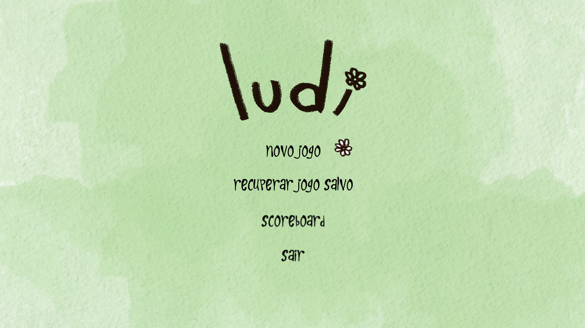
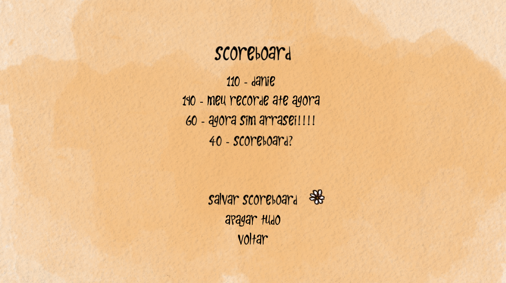
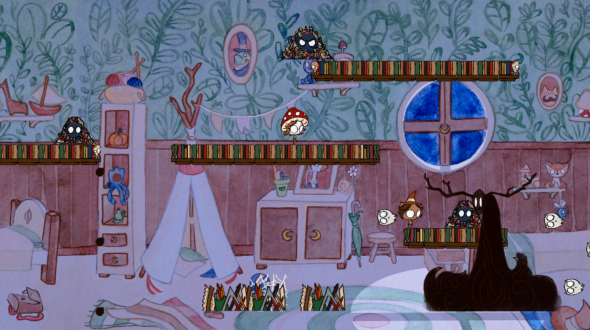

# 🎮 Ludi

Ludi is a 2D platformer game built entirely from scratch, without a game engine, using C++ and the SFML (Simple and Fast Multimedia Library) library.  

It was originally developed as a college project for the Programming Techniques course in the Computer Engineering program at the *Federal University of Technology – Paraná (UTFPR)*, taught by Prof. Jean Simão (Class S71). This is a post-submission version, with minor refactoring and polishing.
The game was co-created by **Francisco Cardoso Becheli** and **Daniel Augusto Pires de Castro**.

---

## 🕹️ About the Game

Ludi is a simple 2D platformer that features:

- Classic side-scrolling movement, jumping and projectile mechanics  
- Local multiplayer up to 2 players
- 2 levels with increasing difficulty, including a final boss  
- Enemies, spikes, and interactive elements in each level
- A scoreboard and main menu
- Saving and loading features
- Background music and sound effects  

All graphics and logic systems were coded manually, no game engine or external framework beyond SFML were used.

---

## 🧩 Technical Details

- **Language:** C++11
- **Graphics/Audio:** SFML 2.5.1  
- **Development Environment:** Visual Studio 2019  
- **Architecture:** Object-oriented design, modular class structure
- **Design:** The project was designed using [UML diagrams](docs/diagrams).

---

## 📸 Screenshots

**Main Menu**  

**Scoreboard**  

**Level 1**  

**Level 2**  

---

## 🧑‍💻 Authors

- **Francisco Cardoso Becheli**  
- **Daniel Augusto Pires de Castro**

---

## ⚙️ How to Run

You can download the latest release from the [Releases](https://github.com/franciscobecheli/ludi/releases) page and play the game directly.  

If you prefer to build from source, follow these steps:

1. Clone the repository
2. Download the [SFML 2.5.1 SDK](https://www.sfml-dev.org/download.php) (x86)
3. Place the extracted SFML folder inside a new directory named `external/` at the root of the project
4. Open the solution file `Ludi.sln` in Visual Studio 2019/2022 
5. Build the project in Debug or Release mode  
6. Run the executable from the `/x64/Debug` or `/x64/Release` folder  

Make sure that the `fonts/`, `textures/`, and `musics/` folders are located alongside the executable.

---

## 🧾 License

This project was created for educational purposes and is made available as a **public academic showcase**.

---
